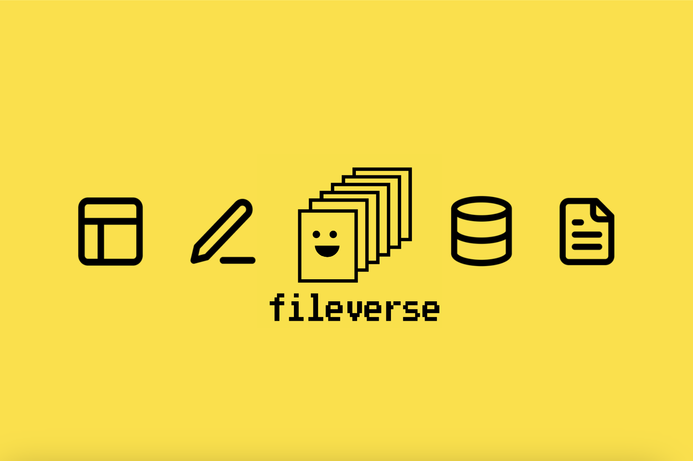

# fileverse

## 📝 Description

Contracts for Fileverse Portal - onchain collaboration, file management, and decentralized access control

## 🔗 Links

- **Website**: https://fileverse.io

## 🏷️ Category

Privacy Technology

## 📚 Research Files

This project includes comprehensive research data:

### Reports
- [Security](reports/SECURITY.md)
- [Team](reports/TEAM.md)
- [Technical](reports/TECHNICAL.md)
- [Blockchain Metrics](reports/blockchain_metrics.md)
- [Organization Profile](reports/organization_profile.md)
- [Osint Statistics](reports/osint_statistics.md)
- [Oso Assessment 2025 10 06](reports/oso_assessment_2025-10-06.md)
- [Technical Analysis](reports/technical_analysis.md)

### Analysis Data
- [Github Analysis](analysis/github_analysis.json)
- [Metrics](analysis/metrics.json)
- [Org Intelligence](analysis/org_intelligence.json)
- [Osint Pandas](analysis/osint_pandas.json)
- [Osint Stats](analysis/osint_stats.json)
- [Tech Stack Analysis](analysis/tech_stack_analysis.json)

### Raw Research Data
- [Research Methodology JSON](constitutional_research.json) - Complete structured data
- [Sources](sources/) - Raw research sources and references

## 📊 Code Analysis

**Repository**: [https://github.com/fileverse/fileverse-ddoc](https://github.com/fileverse/fileverse-ddoc)

- **Total Lines of Code**: 12,460
- **Total Files**: 273
- **Smart Contracts**: 0
- **Test Files**: 0

### Languages
- Typescript: 195 files
- Javascript: 4 files

*Analysis confidence: 95%*

---

*Research Methodology: 100% Real Data - Zero Fabrication*
