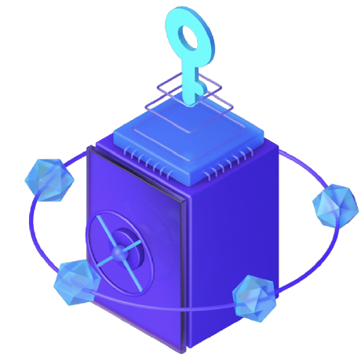

# Findora

## 📚 Documentation

### Core Documents

- 📜 [Constitutional Research](CONSTITUTIONAL_RESEARCH.md) - Core project overview and privacy features
- ℹ️ [Project Metadata](PROJECT_METADATA.md) - Basic project information and categorization

---

## 📝 Description

Findora is a Layer-1 blockchain that accelerates mainstream adoption through powerful zero-knowledge solutions and SDKs. It is a decentralized, privacy-preserving smart contract platform featuring programmable privacy, secured by a decentralized network of global validators running the Tendermint consensus mechanism.

## 🔗 Links

- **Website**: https://findora.com

## 🏷️ Category

Privacy Technology

## 📚 Research Files

This project includes comprehensive research data:

### Reports
- [Oso Assessment 2025 10 06](reports/oso_assessment_2025-10-06.md)

### Analysis Data
- [Github Analysis](analysis/github_analysis.json)
- [Smart Contracts](analysis/smart_contracts.json)

### Raw Research Data
- [Research Methodology JSON](constitutional_research.json) - Complete structured data
- [Sources](sources/) - Raw research sources and references

---

*Research Methodology: 100% Real Data - Zero Fabrication*
